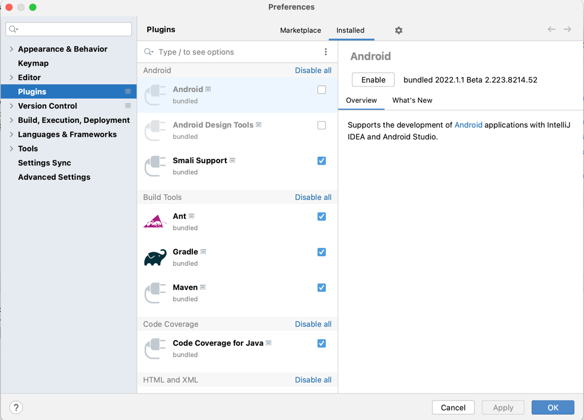
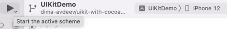
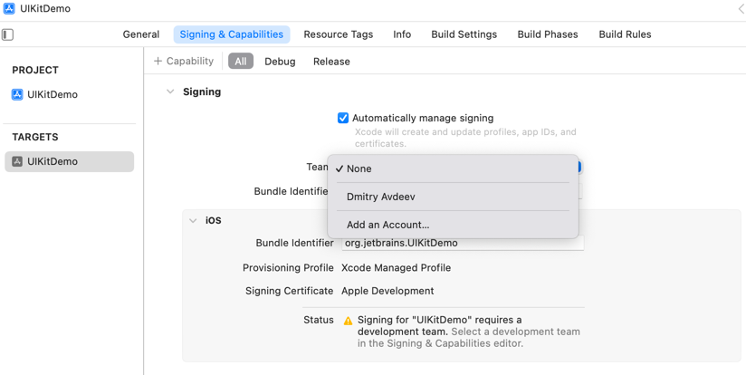
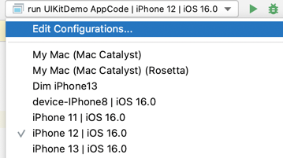

## Run UIKitDemo with Xcode

- Install Cocoapods
- Open directory compose/frameworks/support in Intellij IDEA
- Disable Android plugin
  
- Restart Intellij IDEA and reopen project compose/frameworks/support
- Wait while IDEA syncing gradle project
- Run command in directory uikitApp

```bash 
pod install
 ```

- Open Xcode workspace file

```bash
open UIKitDemo.xcworkspace
```

- Choose simulator and press "Start"  
  

- To run on real device, you can set your TEAM_ID in [Configuration/TeamId.xcconfig](Configuration%2FTeamId.xcconfig).
  Or set your Team in "Signing & Capabilities" settings  
  

## Run UIKitDemo with AppCode

- Install KMM plugin
- Open directory compose/frameworks/support in AppCode
- Wait while AppCode syncing gradle project
- Choose run configuration and specify simulator  
  
